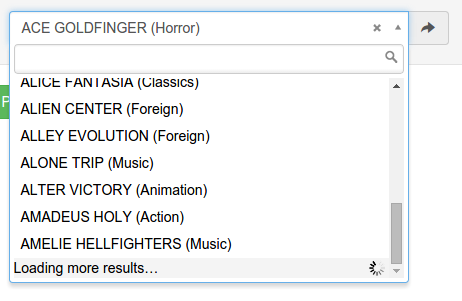

yii2-model-selector
===========
Yii2 widget to replace native html select in case of a long option lists.  
Based on select2 jquery plugin.  
Bounded to ActiveRecord models.  
Supports server side search and paging.  
Contains select2-bootstrap.less (t0m/select2-bootstrap-css) for using with custom twitter bootstrap library.  
Bundled with two prebuilt stylesheets for standard bootstrap and AdminLTE theme.  



Installation
------------

The preferred way to install this extension is through [composer](http://getcomposer.org/download/).

Either run

```
php composer.phar require pavlm/yii2-model-selector:dev-master
```

or add

```
"pavlm/yii2-model-selector": "dev-master"
```

to the require section of your `composer.json` file.


Usage
-----

Most simple case:  

```php
echo ModelSelector::widget([
    'name' => 'field',
    'query' => Film::find(),
    'itemId' => 'film_id',
    'itemLabel' => 'title',
]);
```
